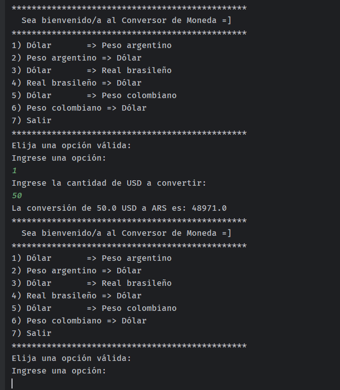

## Desarrollo del Challenge Conversor de Monedas Alura Latam

### En este Challenge se puse en practica los conocimientos aprendidos en los cursos de:

1. Java: Creando tu primera aplicación.
2. Java: Aplicando la orientación a objetos.
3. Java: Consumir API, escribir archivos y manejar errores.
4. Java: Trabajar con listas y colecciones de datos.

#### Prueba:
Conversion de USD a Pesos argentinos.

